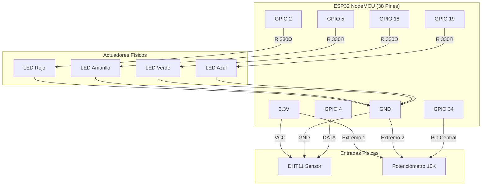

# Universidad Privada Antenor Orrego (UPAO)
## Facultad de Ingeniería
### Programa de Estudios de Ingeniería de Sistemas e Inteligencia Artificial

*   **Curso:** Internet de las Cosas (IoT) - 2026-1
*   **Tema:** Monitoreo y Control IoT con ESP32, Sensor DHT11 y Potenciómetro en Blynk (Uso de BlynkTimer)
*   **Docente:** Llanos León, Lenin Humberto
*   **Autor:** Sánchez Chiroque, César Diego
*   **Ciudad:** Trujillo – Perú

---

## 1. Introducción
Este proyecto implementa un sistema IoT físico utilizando un microcontrolador **ESP32 (versión de 38 pines)** integrado con la plataforma **Blynk IoT**. El sistema está diseñado para realizar dos tareas fundamentales en la automatización y telemetría:
*   **Control Remoto (Actuación):** Encendido y apagado independiente de cuatro LEDs físicos (Rojo, Amarillo, Verde, Azul) desde un Dashboard web o móvil en Blynk.
*   **Monitoreo Remoto (Telemetría):** Lectura periódica de variables ambientales (temperatura y humedad mediante el sensor DHT11) y voltaje eléctrico (potenciómetro de 10kΩ a través del ADC pin GPIO 34), con un mecanismo integrado para detectar y alertar ante fallos de lectura del sensor.

---

## 2. Materiales y Componentes Requeridos
Para armar y ejecutar este circuito de forma física necesitarás:

| Componente | Cantidad | Descripción |
| :--- | :---: | :--- |
| **ESP32 DevKit v1 (38 pines)** | 1 | Tarjeta de desarrollo WiFi de 2.4 GHz. |
| **Sensor DHT11** | 1 | Sensor digital de temperatura (0-50°C) y humedad (20-90% RH) - *Carcasa Azul*. |
| **Potenciómetro (10kΩ)** | 1 | Resistencia variable para simular lecturas analógicas de voltaje. |
| **LEDs (Rojo, Amarillo, Verde, Azul)** | 4 | Actuadores de salida digitales. |
| **Resistencias de 330Ω** | 4 | Resistencias protectoras para los LEDs (código: *Naranja-Naranja-Marrón*). |
| **Resistencia de 10kΩ** | 1 | Pull-up para el pin de datos del DHT11 (si no viene montado en PCB). |
| **Protoboard y Cables Jumper** | 1 | Base de pruebas y cables para interconexiones. |
| **Cable de Conexión USB** | 1 | Micro-USB o USB-C para alimentación y carga. |

---

## 3. Esquema de Conexiones (Circuito Físico)

En la placa del ESP32 de 38 pines, conecta los pines según la siguiente distribución:

### Tabla de Conexiones del ESP32

| Periférico | Pin del Periférico | Pin del ESP32 | Descripción | Pin Virtual Blynk |
| :--- | :--- | :--- | :--- | :---: |
| **LED Rojo** | Ánodo (vía R 330Ω) | **GPIO 2** | Salida digital LED Rojo | **V0** (Control) / **V4** (Estado) |
| **LED Amarillo** | Ánodo (vía R 330Ω) | **GPIO 5** | Salida digital LED Amarillo | **V1** (Control) / **V5** (Estado) |
| **LED Verde** | Ánodo (vía R 330Ω) | **GPIO 18** | Salida digital LED Verde | **V2** (Control) / **V6** (Estado) |
| **LED Azul** | Ánodo (vía R 330Ω) | **GPIO 19** | Salida digital LED Azul | **V3** (Control) / **V7** (Estado) |
| **DHT11** | DATA | **GPIO 4** | Entrada digital del sensor | **V8** (T°), **V9** (H%), **V10** (Error) |
| **DHT11** | VCC | **3.3V** | Alimentación (3.3V) | - |
| **DHT11** | GND | **GND** | Tierra común | - |
| **Potenciómetro** | Pin Central (Wiper) | **GPIO 34** | Entrada analógica (ADC1_CH6) | **V11** (Voltaje) |
| **Potenciómetro** | Extremo Izquierdo | **3.3V** | Alimentación de referencia | - |
| **Potenciómetro** | Extremo Derecho | **GND** | Tierra común | - |
| **Común** | Cátodos de todos los LEDs | **GND** | Tierra común | - |

### Diagrama de Flujo y Conexiones



---

## 4. Configuración en Blynk IoT

Para comunicar tu hardware con la nube, configura los siguientes elementos en la consola web de Blynk:

### Credenciales de la Plantilla
*   **Template ID:** `TMPL2Pz9GZGrL`
*   **Template Name:** `Practica Calificada`
*   **Auth Token:** `j-6cX1kiKaQS5F6d1A5QLGN9W3-_--bq`

### Datastreams (Pines Virtuales)
Añade 12 Datastreams virtuales con las siguientes configuraciones:

| Nombre Datastream | Pin Virtual | Tipo de Dato | Mínimo | Máximo | Por Defecto |
| :--- | :---: | :---: | :---: | :---: | :---: |
| **Control LED Rojo** | **V0** | Integer | 0 | 1 | 0 |
| **Control LED Amarillo** | **V1** | Integer | 0 | 1 | 0 |
| **Control LED Verde** | **V2** | Integer | 0 | 1 | 0 |
| **Control LED Azul** | **V3** | Integer | 0 | 1 | 0 |
| **Estado LED Rojo** | **V4** | Integer | 0 | 255 | 0 |
| **Estado LED Amarillo** | **V5** | Integer | 0 | 255 | 0 |
| **Estado LED Verde** | **V6** | Integer | 0 | 255 | 0 |
| **Estado LED Azul** | **V7** | Integer | 0 | 255 | 0 |
| **Temperatura** | **V8** | Double | -40 | 80 | 0 |
| **Humedad** | **V9** | Double | 0 | 100 | 0 |
| **Alerta Falla DHT11**| **V10** | Integer | 0 | 1 | 0 |
| **Voltaje Potenciómetro**| **V11** | Double | 0 | 3.3 | 0 |

> [!NOTE]
> Los pines de Estado (V4 a V7) se configuran de **0 a 255** en la plataforma web de Blynk porque los widgets LED virtuales controlan su brillo mediante un valor de byte (0 = Apagado, 255 = Brillo máximo).

---

## 5. Código de Programación (Explicación del Firmware Físico)

El firmware utilizado está optimizado para conectarse mediante WiFi y gestionar las tareas periódicamente a través del `BlynkTimer`, evitando desconexiones causadas por funciones bloqueantes como `delay()`.

El código fuente completo está disponible para descarga directa en este repositorio:
🔗 **[Repositorio GitHub: ESP32-BlynkTimer](https://github.com/Cesar-Sanchez-sof/ESP32-BlynkTimer.git)**

### Estructura del Código Fuente
El archivo `Semana11_ESP32_Blynk.ino` ejecuta las siguientes funciones críticas:
1.  **Callbacks de Activación (`BLYNK_WRITE`):** Capturan el pulso del interruptor web, configuran el estado digital del GPIO físico (`digitalWrite`) y devuelven el estado al LED indicador del Dashboard (`Blynk.virtualWrite` escalado por 255).
2.  **Temporización no bloqueante (`BlynkTimer`):** Configura la función `sendSensorData` para que se ejecute estrictamente cada 2 segundos sin bloquear el loop.
3.  **Conversión ADC a Voltaje:** Mide el valor crudo en el GPIO 34 (rango 0 a 4095) y lo traduce a voltios: `(adcValue / 4095.0) * 3.3`.
4.  **Detección de Errores (Failsafe):** Evalúa si la lectura del sensor DHT11 retorna `NaN` (Not a Number). En caso de desconexión o fallo, apaga las variables en Blynk y activa el LED indicador de error virtual `V10` en `1` (ON).

---

## 6. Descarga y Carga del Código (Guía Paso a Paso para Principiantes)

#### Paso 1: Descargar el código desde GitHub
1. Haz clic en el botón verde **`<> Code`** de la barra superior derecha de este repositorio.
2. Selecciona **`Download ZIP`** y guarda el archivo en tu computadora.
3. Extrae el archivo `.zip` en tu disco local.

#### Paso 2: Abrir el proyecto en Arduino IDE
1. Entra a la carpeta extraída y abre el directorio `Semana11_ESP32_Blynk`.
2. Haz doble clic sobre **`Semana11_ESP32_Blynk.ino`** para abrir el editor de Arduino IDE.

#### Paso 3: Configurar tus credenciales de Red
Edita las siguientes líneas al inicio del código con los datos específicos de tu red local y plantilla Blynk:
```cpp
// Credenciales Blynk
#define BLYNK_TEMPLATE_ID   "REEMPLAZA_CON_TU_TEMPLATE_ID"
#define BLYNK_TEMPLATE_NAME "REEMPLAZA_CON_TU_TEMPLATE_NAME"
#define BLYNK_AUTH_TOKEN    "REEMPLAZA_CON_TU_AUTH_TOKEN"

// Credenciales WiFi (Debe ser red de 2.4 GHz)
char ssid[] = "Nombre_De_Tu_WiFi";
char pass[] = "Contraseña_De_Tu_WiFi";
```

#### Paso 4: Carga del firmware
1. Conecta tu ESP32 mediante el cable USB.
2. Ve a **`Herramientas -> Placa`** y selecciona **`DOIT ESP32 DEVKIT V1`**.
3. Selecciona el puerto correspondiente en **`Herramientas -> Puerto`**.
4. Haz clic en el icono de la flecha (**Subir**). Si el compilador se detiene en `Connecting......_____`, mantén presionado el botón físico **`BOOT`** en tu placa hasta que veas que avanza la escritura.

---

## 7. Pruebas y Validación del Funcionamiento

### Caso A: Control y Retroalimentación de LEDs
Al presionar el interruptor de `Control LED Rojo (V0)` en el dashboard, el LED rojo físico en el protoboard (GPIO 2) se enciende al instante. Al mismo tiempo, el terminal serial de Arduino imprimirá: `Blynk V0 -> LED ROJO: ENCENDIDO` y el indicador virtual `V4` en el dashboard cambiará a estado encendido.

### Caso B: Telemetría en Tiempo Real
Los gauges de Temperatura y Humedad se actualizarán cada 2 segundos. Al girar el potenciómetro físico, la lectura del voltaje en el dashboard (V11) fluctuará continuamente de forma lineal de `0.0V` a `3.3V`.

### Caso C: Alerta de Desconexión del Sensor
Si desconectas el pin de señal (GPIO 4) o el pin VCC del sensor DHT11, las mediciones en Blynk marcarán `0` y la luz LED de alerta `ERROR DHT11` (V10) se encenderá inmediatamente en color rojo en tu dashboard. Al reestablecer la conexión, el sistema vuelve a enviar mediciones válidas y apaga la alerta (`V10 = 0`).

---

## 8. Diagnóstico de Problemas Comunes

*   **Los LEDs no encienden:** Desconecta el pin del LED en el ESP32 y colócalo en el pin de `3V3`. Si el LED no enciende, está conectado al revés o no tiene conexión a tierra (GND). Si sí enciende, verifica que tu botón en Blynk esté asignado a la señal virtual correcta (`V0`-`V3`) y no directamente al pin digital físico.
*   **Error constante de DHT11:** Asegúrate de que el tipo de sensor en el código sea `#define DHTTYPE DHT11` y que hayas conectado la resistencia de pull-up de 10kΩ entre la pata de datos y 3.3V si estás utilizando el sensor de 4 patas.
*   **Los valores se congelan en el Dashboard al desconectar el circuito:** Es un comportamiento estándar de Blynk para conservar datos históricos. Puedes activar la casilla **"Disable widget if device is offline"** en la configuración de cada widget para que se sombreen en gris cuando apagues el circuito.

---

## 9. Evidencias del Proyecto (YouTube)
*   **Enlace del Videotutorial:** [INSERTAR AQUÍ EL ENLACE DEL VIDEO DE YOUTUBE]
